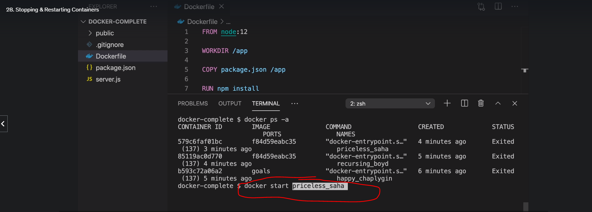

# Run Image generate container
1. Way 1: 
So, with that as background, run a container with no options and by default you have a stdout stream (so docker run | <cmd> works); run with -i, and you get stdin stream added (so <cmd> | docker run -i works); use -t, usually in the combination -it and you have a terminal driver added, which if you are interacting with the process is likely what you want. It basically makes the container start look like a terminal connection session.

2. Way 2: 
I

# Rename Image and container when build or run 
```docker

docker build -t myimage .
docker run --name mycontainer myimage
docker stop mycontainer

```


# Kubernetes
### Minikube is k8s cluster = 1 worker node + 1 master node
### Cubectl is cli to interact with cluster 